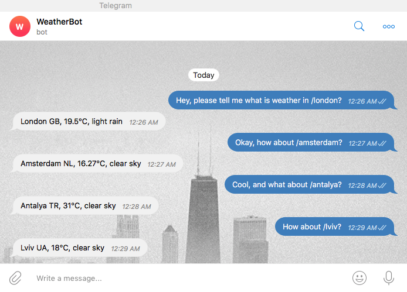

# Weather telegram bot
> Basic telegram bot powered by a webhook that helps you to get current weather in a specific city all around the world.
>
> Bot is called `WeatherBot` that served by [pythonanywhere.com](https://pythonanywhere.com) hosting, search for it in the > `telegram` app to allow it help you to get your desired weather value. Enjoy it!

## Usage
Run script from the root directory of the project:
```bash
~ python bot.py
```

## Demo


## Run tests
Please run tests from the root directory of the project:
```bash
~ pytest -v
```

## Meta
Author – Volodymyr Yahello vyahello@gmail.com

Distributed under the `MIT` license. See [LICENSE](LICENSE.md) for more information.

You can reach out me at:
* [https://github.com/vyahello](https://github.com/vyahello)
* [https://www.linkedin.com/in/volodymyr-yahello-821746127](https://www.linkedin.com/in/volodymyr-yahello-821746127)

## Contributing
1. clone the repository
2. configure Git for the first time after cloning with your `name` and `email`
3. `pip install -r requirements.txt` to install all project dependencies
