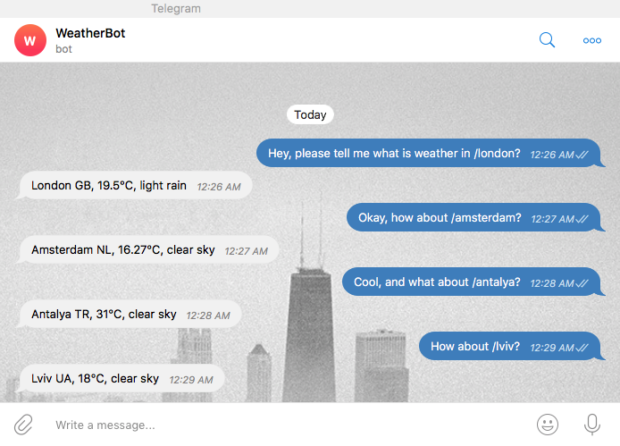

[](https://travis-ci.org/vyahello/weather-chatbot)
[](https://coveralls.io/github/vyahello/weather-chatbot?branch=master)
[](https://github.com/vyahello/weather-chatbot/releases)
[](https://GitHub.com/vyahello/weather-chatbot/graphs/watchers/)
[](https://github.com/vyahello/weather-chatbot/network/members)
[](https://github.com/vyahello/weather-chatbot/stargazers)
[](https://GitHub.com/vyahello/weather-chatbot/graphs/contributors/)

[](LICENSE.md)
[](https://hitsofcode.com/view/github/vyahello/weather-chatbot)

# Weather chatbot
> Simple telegram bot that helps you to get current weather in a specific city all around the world.
>
> Bot is called `WeatherBot` that served by, search for it in the `telegram` app to allow it help you to get your desired weather value. 
> Enjoy it!

**Tools**
- python 3.6+
- [flask](https://pypi.org/project/Flask/)
- [pytest](https://pypi.org/project/pytest/)
- [travis CI](https://travis-ci.org)
- [pythonanywhere](https://pythonanywhere.com)

## Usage
Run script from the root directory of the project:
```bash
~ python chat.py
```

## Demo


## Development notes

### Run unittests
Please run tests from the root directory of the project:
```bash
~ pytest
```
After please open `test-report.html` file to check report for unittests execution.

### Release notes

* 0.1.0
  * Add Travis CI

### Meta
Author – Volodymyr Yahello

Distributed under the `Apache 2.0` license. See [LICENSE](LICENSE.md) for more information.

You can reach out me at:
* [vyahello@gmail.com](vyahello@gmail.com)
* [https://github.com/vyahello](https://github.com/vyahello)
* [https://www.linkedin.com/in/volodymyr-yahello-821746127](https://www.linkedin.com/in/volodymyr-yahello-821746127)

### Contributing
1. clone the repository
2. configure Git for the first time after cloning with your `name` and `email`
3. `pip install -r requirements.txt` to install all project dependencies
3. `pip install -r requirements-dev.txt` to install all project development dependencies
